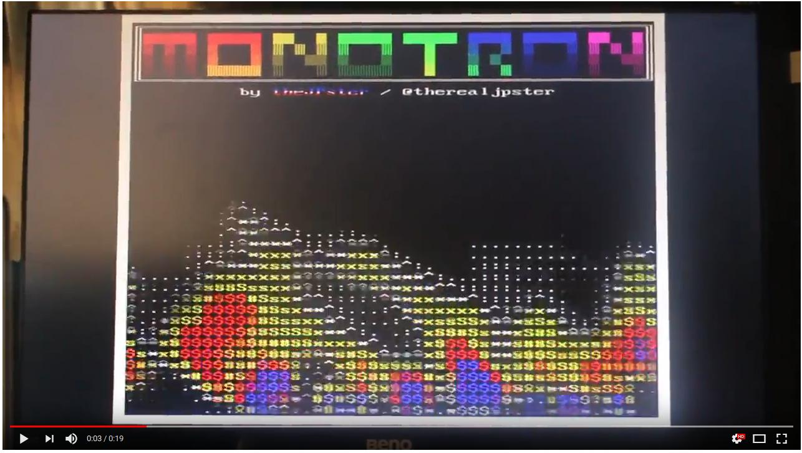

# Monotron.

> A simple 1980's home computer style application for the Tiva-C Launchpad

## Introduction

Monotron is powered by a Texas Instruments TM4C123 microcontroller, containing
an ARM Cortex-M4 core and a number of peripherals. This processor was chosen
because it is available on an inexpensive dev-kit - the Tiva-C Launchpad - and
I happened to have some lying around. The challenge I set myself was, how much
can you squeeze out of this tiny CPU? And can you do it all in pure-Rust?


[See Monotron in Action!](https://www.youtube.com/watch?v=7x_92PXKSN4)

## Features

* 800x600 8-colour VGA output
* 32 KiB SRAM (24 KiB usable for applications)
* 256 KiB Flash ROM
* Choice of low-memory text display mode or full bitmap graphics mode
* 8-bit mono audio output
* USB Serial I/O
* Atari 9-pin joystick interface
* Simple command-line interface
* Loadable apps
* Watch this space!

## Video

Monotron generates an 800x600 VGA video signal at 60 Hz using three SPI
peripherals and a timer to generate the horizontal sync signals. It can do
this because the VGA signal has a pixel clock of 40 MHz and the Tiva-C
Launchpad's TM4C123 CPU runs at 80 MHz. We save on the number of pixels we
have to push through the SPIs by running at half-resolution horizontally
(giving 400x600), which also halves the pixel clock to 20 MHz. I did try 40
MHz mode and it didn't work.

Monotron has two 'modes' it can display on this VGA output.

### Text Mode

Text Mode has a 48 character by 36 line display. Each character cell is 8
pixels wide and 16 pixels high and can take any character from the 8-bit [MS-
DOS Code Page 850](https://en.wikipedia.org/wiki/Code_page_850) character set,
and can have any foreground and background colour from the supported set:

* White
* Red
* Yellow
* Green
* Cyan
* Blue
* Magenta
* Black

The text buffer takes up `48 x 36 x 2 = 3,456` bytes of SRAM.

The built-in font is taken from
[FreeBSD](http://web.mit.edu/freebsd/head/share/syscons/fonts/cp850-8x16.fnt).
There's also a second font which implements Teletext block graphics (or
'sixels').

Any line of text can be displayed in "double height" mode, showing either the
top-half or bottom-half.

Finally, the display is framed with an 8 pixel border at the sides and a 12
pixel border at the top and bottom, to make everything fit neatly and to help
with any minor overscan issues if you use an actual CRT monitor.

### Graphics Mode

Graphics Mode can be enabled and disabled at run-time. It's not enabled by
default because bitmap graphics take up a lot of RAM!

You can attach a 1-bit-per-pixel graphics buffer that is some multiple of 384
pixels (i.e. 384 bits or 48 bytes) long. This buffer is displayed using line-
doubling (i.e. every line is shown twice) so you can go up to 384x288
resolution maximum, which will fill the screen. Each bit from the bitmap is
coloured according to the text cell (see above) it sits on top of, much like a
ZX Spectrum. A full-screen bitmap therefore uses the 3,456 bytes of SRAM from
text-mode plus an additional `384x288 / 8 = 13,824` bytes of SRAM.

## Compiling

You will need to build using Rust Nightly, as we need various experimental
features for Embedded development that are not yet available in Stable. I am
aiming to support Stable Rust by the Rust 2018 release.

```
$ rustup toolchain install nightly
$ git clone https://github.com/thejpster/monotron.git
$ cd monotron
$ rustup override set nightly
$ rustup target add thumbv7em-none-eabihf
$ cargo build --release
```

To program the board, you can use lm4flash:

```
$ cargo build --release
$ arm-none-eabi-objcopy -O binary ./target/thumbv7em-none-eabihf/release/monotron ./target/thumbv7em-none-eabihf/release/monotron.bin
$ lm4flash ./target/thumbv7em-none-eabihf/release/monotron.bin
```

Or you can debug in GDB (which will automatically load the program first):

```
$ openocd
<switch to a different terminal>
$ cargo run --release
```

OpenOCD should read our `openocd.cfg` file, which directs it to use the
correct configuration. You may need to run `sudo openocd` if your user doesn't
have permission to open the USB device.

To exit GDB, you may need to press Ctrl-C multiple
times, as it seems it can get a bit stuck.

## Connecting

### VGA

Your VGA connector requires five wires:

* Pin 1: Red - connect to PF1 via a 330 Ohm resistor.
* Pin 2: Green - connect to PB7 via a 330 Ohm resistor.
* Pin 3: Blue - connect to PD3 via a 330 Ohm resistor.
* Pin 5: Ground - connect to GND
* Pin 6: Red Return - connect to GND
* Pin 7: Green Return - connect to GND
* Pin 8: Blue Return - connect to GND
* Pin 13: H-Sync - connect to PB4
* Pin 14: V-Sync - connect to PB5

I'm using this arrangement using random resistors I found on my desk, and it
works for me (although the picture is a bit dim, as it actually produces about
0.6V peak rather than 0.7V):

```
-----+
     |     +------+ 330 Ohm        Co-ax in the VGA cable
PB7 o+-----|      |------------(o)==================)+
     |     +------+                                  |
-----+                                               |
                                                    +-+
                                                    | |
                                                    | | 75 Ohm
                                                    | | (in Monitor)
                                                    +-+
                                                     |
                                                     o
                                                    GND
```

The 330 Ohm resistor forms a resistive divider with the 75 Ohm resistor in the
monitor. This is needed to drop the 3.3V output down to 0.7V. Some monitors
are more tolerant of over voltage than others. The higher the resistor you
use, the less current you pulling out of the GPIO pin (we're just over 8mA
currently, which is a bit high) but the lower the voltage the monitor will see
and the dimmer your picture will be. Conversely if you lower the resistor,
more current will flow but it'll be a brigher picture. I'd save your chip from
damage and just wind the brightness control up!

Obviously only one channel is shown above - wire up the blue and red channels
in exactly the same fashion. Finally, don't forget to keep your wires short!
You will have noise if you try and send a 20 MHz signal down 10cm of
unshielded wire.

In a perfect world, your board would offer a 75 ohm source impendance matching
the monitor's 75 ohm impedance, to reduce reflections, but at this resolution
it doesn't seem to matter. If you want do do that, you'll need to make a
resistive divider to drop the 3.3V to 1.4V, and then feed that through a
high-bandwidth (>20 MHz) unity-gain amplifier, with a 75 ohm resistor on the
output. The pair of 75 ohm resistors will then drop the 1.4V to 0.7V in the
monitor.

### UART

Monotron uses UART0 on the Tiva-C Launchpad, which is converted to USB
Serial by the on-board companion chip. Connect with your favourite Serial
terminal at 115,200bps. Send UTF-8 and it'll get converted to MS-DOS Code Page
850 inside the Monotron.

I hope to add support for a second UART (UART 1) on an FTDI-compatible 6-pin
connector (3.3v signalling).

### Audio

Monotron can generate 8-bit audio output using PWM on pin PE4. I use the
[monotron- synth](https://github.com/thejpster/monotron-synth) which has a
three-channel wavetable synthesiser which can bleep and bloop with square
waves, sine waves, sawtooth waves and generate white noise.

You'll need to run the pin through a low-pass filter to remove the noise, and
connect it to an amplifier as the GPIO pin won't really supply much current.

### Joystick

There are five active-low inputs corresponding to Up, Down, Left, Right and Fire.
You can connect these inputs to a standard Atari 9-pin Joystick as follows:

| Launchpad Pin | Tiva-C Pin | Joystick Pin | Function |
|---------------|------------|--------------|----------|
| J4.6          | PC6        | 1            | Up       |
| J4.7          | PC7        | 2            | Down     |
| J4.8          | PD6        | 3            | Left     |
| J4.9          | PD7        | 4            | Right    |
| J4.10         | PF4        | 6            | Fire     |
| J3.2          | GND        | 8            | Ground   |

### PS/2 Keyboard

PS/2 keyboard support sort of worked, but wasn't reliable so it's currently
missing. When complete, it will use the
[pc-keyboard](https://github.com/thejpster/pc-keyboard) crate. Any UK 102-key
or 105-key keyboard should work - support for other layouts welcome as a PR!

The pinout will probably be:

* +CLK: PB2
* +DATA: PE0
* Ground: GND
* Vcc: 5V

PS/2 keyboards have 5V I/O. It's specified as open-collector but keyboards
sometimes contain internal pull-up resistors to 5V. All of the LM4F120/TM4C123
I/O pins are 5V tolerant when in input mode (except PB0, PB1, PD4, PD5). You
should probably add a 10k pull-up resistor to 5V on both +CLK and +DATA just
in case your keyboard hasn't got one.

Monotron currently doesn't support talking back to the keyboard (e.g. to turn
the SCROLL, NUM and CAPS-LOCK lights on)- to do so would probably require more
robust interface circuitry.

### SD/MMC

One day I might add SD Card support for programing loading/saving.

### I2C

One day I might add I2C support for reading simple sensors or real-time
clocks.

## Running

When running, a simple command driven interface is presented. Commands can be
entered over serial, or using a PS/2 keyboard. Commands are split on
whitespace and then interpreted based on the left-most word. Enter the command
'help' to see a list of commands. Some commands place you in to a sub-menu -
use 'exit' to return to the previous menu.

## Loading apps

Applications can be compiled and loaded into RAM for exection. They must be
linked to run from address `0x2000_0DF4`. The first four bytes of the image
must be the address of the start function, with prototype `fn start(const
struct callbacks_t* callbacks) -> int32`. The callback structure is:

```C
struct callbacks_t {
    void* p_context;
    int32_t(*putchar)(void* p_context, char ch);
    int32_t(*puts)(void* p_context, const char*);
    int32_t(*readc)(void* p_context);
    void(*wfvbi)(void* p_context);
    int32_t(*kbhit)(void* p_context);
    void (*move_cursor)(void* p_context, unsigned char row, unsigned char col);
    int32_t (*play)(void* p_context, uint32_t frequency, uint8_t channel, uint8_t waveform, uint8_t volume);
};
```

The C functions exported to the apps are:

* `puts` - print an 8-bit string (certain escape sequences are understood)
* `putchar` - print an 8-bit character
* `readc` - blocking wait for keyboard/serial input
* `wfvbi` - wait for next Vertical Blanking Interval
* `kbhit` - return 1 if a key has been pressed (and so `readc` won't block)
* `move_cursor` - move the cursor to change where the next print goes
* `play` - play a note on one of the synthesizer channels

You can use the `upload` Python script in this repo to upload binary images
into RAM.

See [monotron-apps](https://github.com/thejpster/monotron-apps) for example
apps which will run from Monotron's RAM, along with a wrapper which makes
using the callbacks as simple as using a normal C library.

## Changelog

* Version 0.6.2 - Add Joystick support.
* Version 0.6.1 - Add Teletext font and support for font-switching in apps.
* Version 0.6.0 - Added sound and support for apps running from RAM. Removed PS/2 keyboard support.
* Version 0.5.0 - Added 1bpp graphics mode.
* Version 0.4.0 - Added PS/2 keyboard support.
* Version 0.3.0 - Backspace works.
* Version 0.2.0 - Switch to a text buffer to save RAM. Basic animations work.
* Version 0.1.0 - First release. VGA output works but menu is full of dummy commands and there's no keyboard input.

## License

Licensed under either of

- Apache License, Version 2.0 ([LICENSE-APACHE](LICENSE-APACHE) or
  http://www.apache.org/licenses/LICENSE-2.0)

- MIT license ([LICENSE-MIT](LICENSE-MIT) or http://opensource.org/licenses/MIT)

at your option.

## Contribution

Unless you explicitly state otherwise, any contribution intentionally
submitted for inclusion in the work by you, as defined in the Apache-2.0
license, shall be dual licensed as above, without any additional terms or
conditions.
